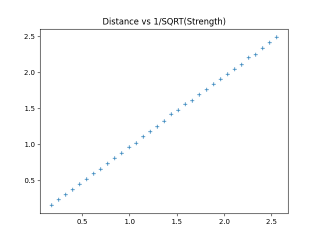
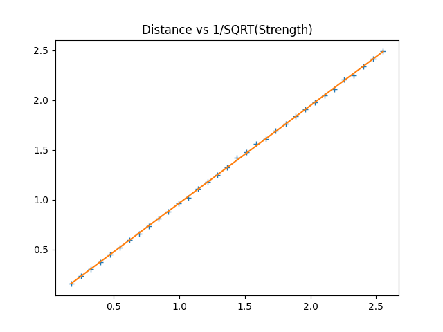

# Robot Location

For this challenge, knowing where your robot is an advantage. 

The python api provided by StudentRobitics doesn't have a way of determining the Robot's location. However, it does provide a sweep() function which determines the bearing and strength of signals received from any towers within range.

    R.radio.sweep()

    [BE] - bearing -72.38  	strength - 0.21
    [PO] - bearing 21.20  	strength - 0.39
    [HV] - bearing 92.83  	strength - 0.19
    [SW] - bearing -166.11  strength - 0.26
    [SZ] - bearing -3.23  	strength - 26.86
    [HA] - bearing -29.77  	strength - 0.20

The strength varies with distance from the tower, if we can work out the distance from the tower, and if we know the locations of the towers, we can work out the location of the robot by projecting from the towers via the bearing and distance.

## Tower locations

The locations for the towers are found in the Arena.wbt file:

    DEF OX SRTerritory {
      translation -6.6 0 3
      territoryName "OXTerritory"
      emitterName "OXEmitter"
      receiverName "OXReceiver"
      textureName "../textures/territory-labels/OX.png"
    }

We can pull those coordinates from the Arena.wbt file and store them in a dictionary.

    station_pos_dict = {
        StationCode.OX: [-6.6, 3],
        StationCode.TS: [-2.75, 2.75],
        StationCode.VB: [-1.95, 0.75],
        StationCode.BG: [-4.2, 0],
        StationCode.EY: [-1.95, -0.75],
        StationCode.PN: [-4.2, -1.8],
        StationCode.TH: [-6.6, -3],
        StationCode.PL: [0, 3],
        StationCode.BE: [0, 1.5],
        StationCode.HA: [0, 0],
        StationCode.YT: [0, -1.5],
        StationCode.FL: [0, -3],
        StationCode.PO: [1.95, -0.75],
        StationCode.SZ: [1.95, 0.75],
        StationCode.SW: [2.75, 2.75],
        StationCode.YL: [4.2, -1.8],
        StationCode.HV: [4.2, 0],
        StationCode.SF: [6.6, -3],
        StationCode.BN: [6.6, 3]
    }

## Strength to Distance

In order to create a strength to distance function, we need to measure the distance to a tower and record the signal strength, we can then use numpy (a python data science library) to do a linear/polynomial fit and reverse engineer the equation.

To measure distance, we will point the robot at a tower and then move in uniform, small increments and record the signal strength at each increment. When the front bumper hits, then we have hit the tower and the distance is the radius of the tower. We then discard the zero responses from the start (before we are in range) and discard the last one (we have hit the tower so the last distance moved won't be uniform). Between each small increment we will need to stop, wait for at least 100 milliseconds (I think this is the radio sweep update time).

For this test I moved the start point of the robot in Arena.wbt to be directly above and pointing to BN. Which is exactly 3.0m away.

    DEF ROBOT-1 SRRobot {
      translation 0 0 6.6
      rotation 0 1 0 1.5708
      controller "sr_controller"
      model "Robot1"
      flagColour 1 1 0
      controllerArgs "1"
    }

Then in robot.py, I creep forward a little a time, recording the strengths.

    strengths = []

    for i in range(0, 100):
        set_heading(mirror(180))
        move(20, 0.3)
        stop(0.3)

        sum_strength = 0.0
        num_measurements = 5
        for j in range(0, num_measurements):
            transmitters = R.radio.sweep()
            for tx in transmitters:
                if tx.target_info.station_code == StationCode.BN:
                    sum_strength += tx.signal_strength
        strengths.append(sum_strength/num_measurements)

        if front_bumper():
            break

Create a matching distances array

    # Create a matching distances array, starting at 3.0, ending at 0.1
    start_pos = 3.0
    end_pos = 0.1
    num_steps = len(strengths)
    distances = [end_pos + (start_pos-end_pos) - i/float(num_steps-1)*(start_pos-end_pos) for i in range(0, num_steps)]

Strip off the strength = 0.0 entries from the front and also strip the very last entry where the bumper hit

    # Strip off the strength=0.0 entries (no response from tower)
    # and the last entry
    first_non_zero_index = 0
    for i in range(0, num_steps):
        if strengths[i] > 0.00001:
            first_non_zero_index = i
            break
    strengths = strengths[first_non_zero_index:-1]
    distances = distances[first_non_zero_index:-1]

Reverse both arrays

    # Reverse both arrays
    strengths.reverse()
    distances.reverse()

If we plot these in matplotlib:

    import numpy
    import matplotlib.pyplot as plt

    plt.plot(distances, strength2, '+')
    plot.title("Distance vs Strength")
    plot.show()

It looks like we have some sort of inverse power law thing going on. Normal radio transmissions usually decrease by an inverse square law based on distance.

So if we plot distance vs 1/sqrt(strength). 

    import numpy
    import matplotlib.pyplot as plt

    plt.plot(distances, numpy.reciprocal(numpy.sqrt(strengths)), '+')
    plot.title("Distance vs Strength")
    plot.show()

This looks very linear. Lets try fitting a line:

    strength2 = np.reciprocal(np.sqrt(strengths))
    m1 = np.poly1d(np.polyfit(distances, strength2, 1))
    r1 = r2_score(distances, m1(strength2))
    print(f"{m1}  - R2 {r1}")

    plt.plot(distances, numpy.reciprocal(numpy.sqrt(strengths)), '+')    
    plt.plot(distances,m1(distances))
    plt.show()

Which gives:

    0.9795 x - 0.0142  - R2 0.9842622496681815

Which means that we can now create our signal strength to distance function:

    def signal_strength_to_distance(signal_strength):
        if signal_strength > 0:
            x = 1.0 / math.sqrt(signal_strength)
            distance = 0.9795 * x - 0.0142
            return distance if distance > 0.0 else 0.0
        # A big number for errors but not too big
        return 100.0

## Calculating the robot position

The bearing to each tower received by the robot is relative to the robot heading. We need an absolute bearing from the tower to the robot. So we need to add the heading to the bearing, we also want the results to be within the range -180, 180, we can achieve this with a modulo '%' function and the offset of 180

    angle = (180 + heading + bearing) % 360

The x and y position of the robot relative to a tower is:

    x = station_pos_dict[station_code][0] + math.sin(angle/360*math.tau)*distance
    y = station_pos_dict[station_code][1] - math.cos(angle/360*math.tau)*distance

## Weighted Average

It's common for the robot to see more than one tower. We can use this to create an average robot position. However, closer towers should be given more weight as the errors due to bearing errors will be less. We can use numpy's weighted average to do this for us.

    xw = numpy.average(xs, weights=weights)
    yw = numpy.average(ys, weights=weights)

where xs, ys are arrays of all the x and y values for each station, and weights is 1 over the distance and a bit:

    weights.append(1.0/(distance + 0.1))

