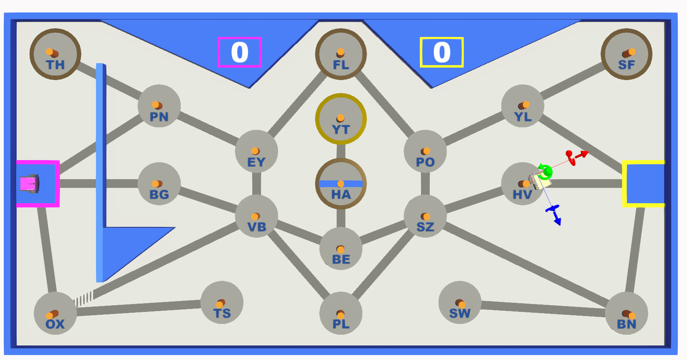

# Rotating around the tower

So I want to know what powers to use on the left and right motors so that the robot circumnavigates a tower.

So I modified the arena to give me some space, I shortened the centre barrier and shifted the right barrier to the left and poisitoned the robot facing directly up and to the right of HV.

Then just ran the motors at different powers. Each combination of power is a circle. 100,99 is a really big circle and 100,1 is a really small circle. It turns out that 100,32 circumnavigates a tower pretty well at a constant distance of 0.4:

    set_power(32,100)
    while True:
        sweep()
        R.sleep(.2)

100,32 will go anti-clockwise. To go clockwise use 32,100.

